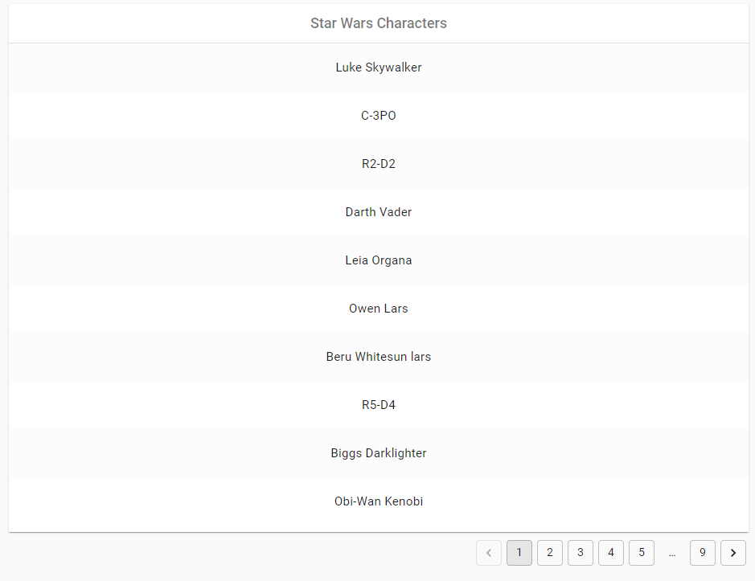
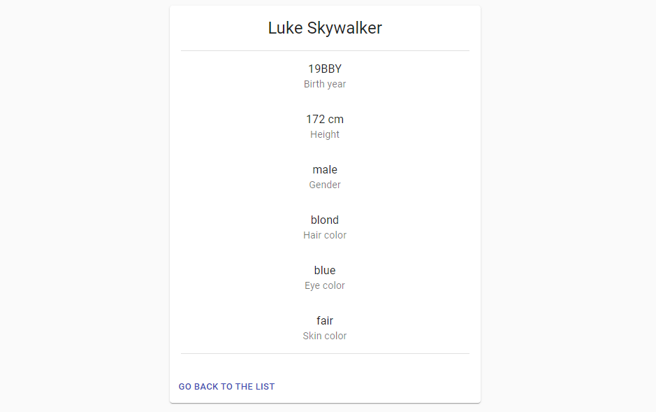

# Star Wars characters browser

> Browse characters from the Star Wars universe. Additional  details are available for every character.

The app consumes data from https://swapi.dev/ API.

## Installation

In the project directory run:

```
npm install
```
and then:
```
npm start
```

## Gallery

Characters' list:


Character's details:

